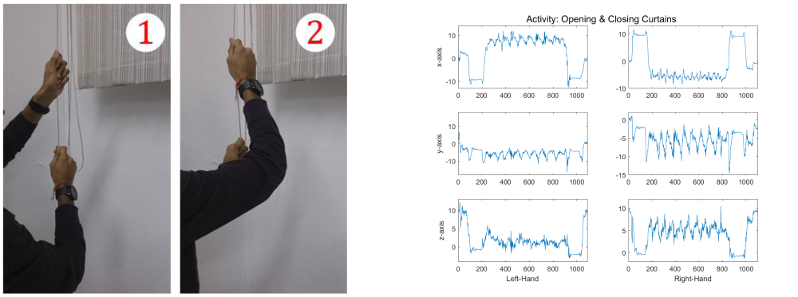
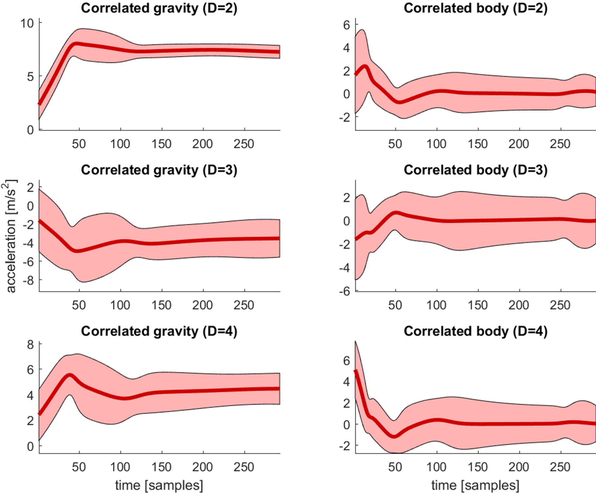
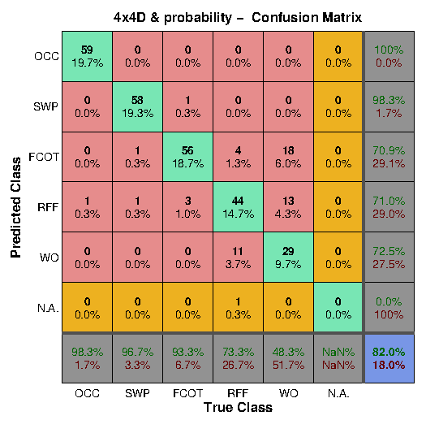

WHARF - Wearable Human Activity Recognition Folder
--------------------------------------------------

1. What is it?
--------------
WHARF - Wearable Human Activity Recognition Folder is a public repository of code
and data sets for Human Activity Recognition systems based on information provided
by wearable sensors.

WHARF is composed of:

- WHARF Data Set, a collection of labelled accelerometer data recordings
  (obtained by a single wrist-worn tri-axial accelerometer) to be used for the
  creation and validation of acceleration models of simple human activities.

- WHARF Code, a collection of MATLAB functions allowing for the creation and
  validation of the models and trials in WHARF Data Set. Detailed descriptions
  of the proposed system and its performance can be found at:

    1. Bruno, B., Mastrogiovanni, F., Sgorbissa, A., Vernazza, T., Zaccaria, R.: 
       Analysis of human behavior recognition algorithms based on acceleration data 
       In: IEEE Int Conf on Robotics and Automation (ICRA), 
       pp. 1602--1607 (2013)

    2. Bruno, B., Mastrogiovanni, F., Sgorbissa, A., Vernazza, T., Zaccaria, R.: 
       Human motion modelling and recognition: A computational approach 
       In: IEEE Int Conf on Automation Science and Engineering (CASE), 
       pp. 156--161 (2012)
       
## Abstract

One of the most challenging fields of research is concerned with the task of understanding
the degree of independence of a person by analysing the characteristics of several daily life tasks
carried out by the subject. The article expands a framework dedicated to the recognition
of single-hand gestures by means of inertial measurements with the additional capability of
recognising bimanual gestures. Modelling is performed through Gaussian Mixture Modelling
(GMM) with K-means optimised selection of Gaussians and Gaussian Mixture Regression (GMR)
and the validation of tests; through Mahalanobis distance comparison and punctual Gaussian a
priori probabilities. Two kinds of models are obtained for 5 activities, namely the 4 × 4D and the
2 × 7D models with implicit and explicit correlation among devices respectively and validations
carried out with each approach for comparison. Validation can be performed twice, once with the
previously mentioned approach and once with the Dynamic Time Warping Method (DTW). With
the whole picture of this work, three out of five activities could be recognised in the majority of
trials.

## Code
The code is separated in two folders: WHARF Code and WHARF Data Set. The first one contains all functions necessary for training and inference and their appropriate functioning depend on the existence of the data set in the second folder. As an example from the activity Open/Close curtains, the model extracted from the activity "Open/Close Curtains (OCC)" can be seen here:

## Installation
This code is written in Matlab and it remains the only requisite to be able to run properly.

## Results
Five actions could be classified with an overal accuracy of 82% as concluded by a K-fold cross validation analysis as seen in this confusion matrix and further explained in our paper.

